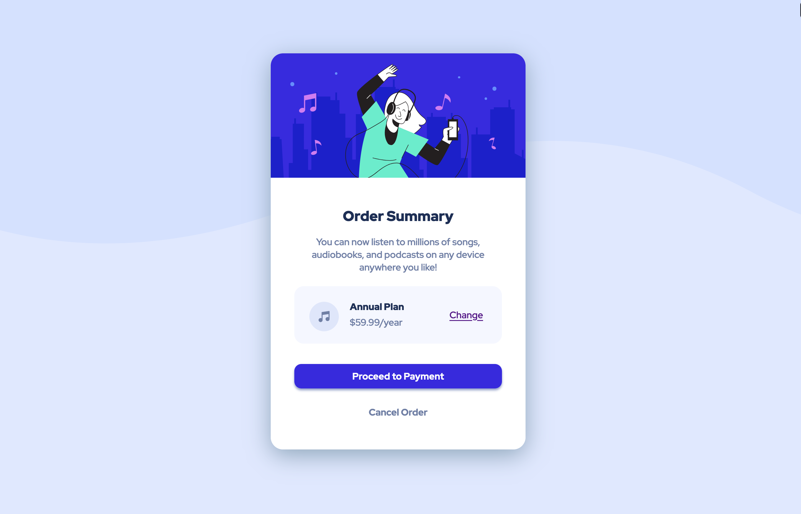
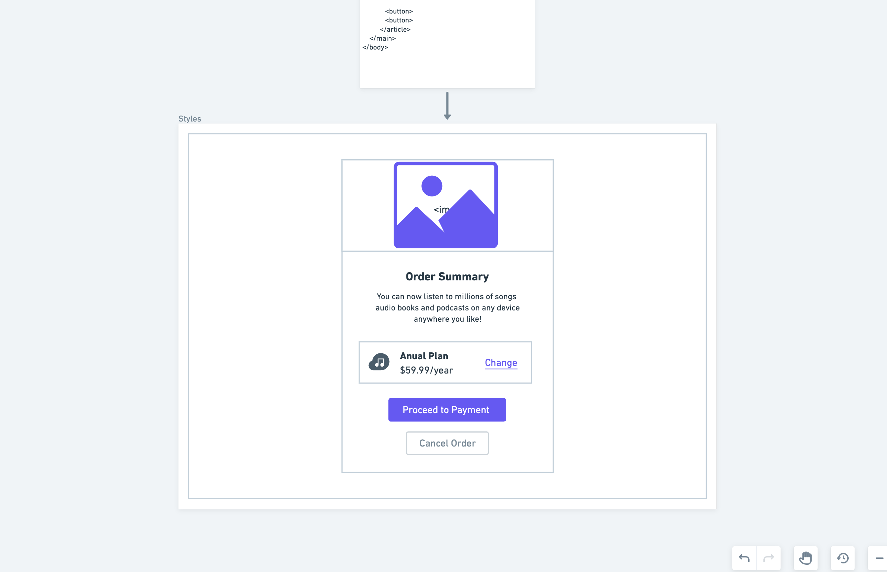
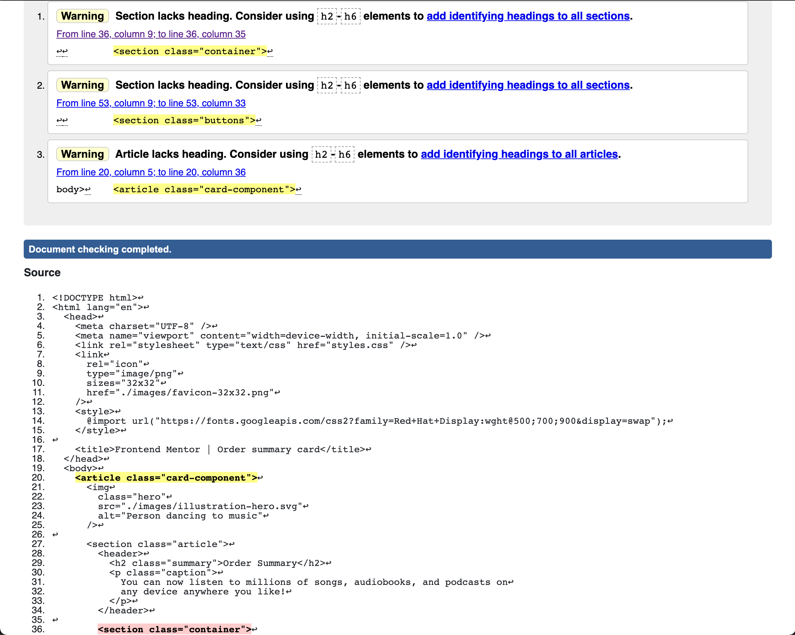

# Frontend Mentor - Order summary card solution

This is a solution to the [Order summary card challenge on Frontend Mentor](https://www.frontendmentor.io/challenges/order-summary-component-QlPmajDUj). Frontend Mentor challenges help you improve your coding skills by building realistic projects.

## Table of contents

- [Overview](#overview)
  - [The challenge](#the-challenge)
  - [Screenshot](#screenshot)
  - [Links](#links)
- [My process](#my-process)
  - [Built with](#built-with)
  - [Continued development](#continued-development)
  - [Useful resources](#useful-resources)
- [Author](#author)
- [Acknowledgments](#acknowledgments)

**Note: Delete this note and update the table of contents based on what sections you keep.**

## Overview

### The challenge

Users should be able to:

- See hover states for interactive elements

### Challenge Complete!



### Links

- Solution URL: [Order Summary Card Component Challege](https://www.frontendmentor.io/challenges/order-summary-component-QlPmajDUj/hub/flexbox-8tipvr3Zx)
- Live Site URL: [Summarycard.vercel](https://summarycard.vercel.app/)

## My process

1. Layout HTML building a rough structure for semantic HTML.

```html
<body>
  <main>
    <article>
      
      <h2>Order Summary</h2>
      <p>Caption</p>
      <section>
        
        <h3>Annual Plan</h3>
        <p>$price$</p>
        <a href="#">Change</a>
      </section>
      <button>Proceed to Payment</button>
      <button>Cancel Order</button>
    </article>
  </main>
</body>
```

2. Create wireframe design layout.



3. Add CSS Styles.
4. Improve semantic HTML and accessibitly with validation.



5. Add TailwindCSS _(to be completed)_

### Built with

- Semantic HTML markup
- CSS custom properties
- Flexbox
- [ARIA](https://www.w3.org/TR/2017/REC-wai-aria-1.1-20171214/)

### Useful resources

- [Learn the Web HTML cheatsheet](https://learn-the-web.algonquindesign.ca/topics/html-semantics-cheat-sheet/) - This helped me quickly reference HTML tags and review their use.

- [CSS Selectors](https://developer.mozilla.org/en-US/docs/Learn/CSS/Building_blocks/Selectors) - This is an another reference which helped me.

## Author

- Frontend Mentor - [@Coding-Edwar](https://www.frontendmentor.io/profile/Coding-Edwar)
- Twitter - [@Coding_Edwar](https://twitter.com/Coding_Edwar)

## Acknowledgments

Shoutout to [@jithusnair](https://www.frontendmentor.io/profile/jithusnair) and [@FluffyKas](https://www.frontendmentor.io/profile/FluffyKas) for leaving me some feedback which I used to improve my project. Thank you!
